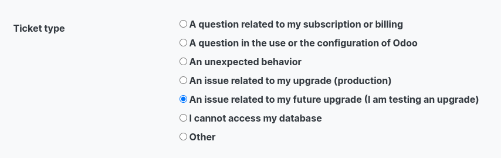
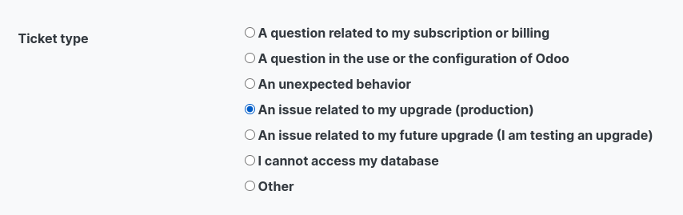
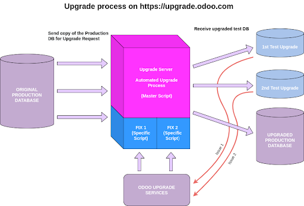

---
layout: post
title:  Upgrade Process[Functional]
permalink: /docs/project/maintenance/upgrade-process-functional
parent: Maintenance
grand_parent: Project
nav_order: 2
---  
# Upgrade Process 

1. Test upgrade request.
2. Custom code upgrades(if any).
3. Testing upgraded database with upgraded custom code.  
  a. [Test Guidance](https://docs.google.com/document/d/1ypNs7JKPOsjNbKpdiKFH7Al6g6whZ9jr7f7duAQ5E1w/edit)
4. Report any issues occurred during testing via odoo support.  
  
5. Request another test upgrade if required.
6. Upon successful testing and validation, plan production upgrade.
7. Upgrade production database.  
  a. Production database will be unavailable while its being upgraded.  
  b. Contact upgrade services team member for downtime estimate.
8. Report any issues post production upgrade via odoo support.  
  

  
  
    

