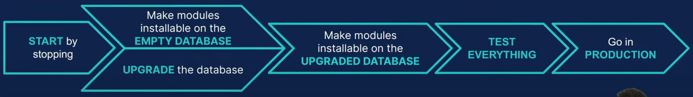

### First step is to find the code of the project depending of the platform  
  
  
* **SAAS**

  * The code should either be on [odoo-ps/psus-custom](https://github.com/odoo-ps/psus-custom) or [odoo/ps-custom](https://github.com/odoo/ps-custom)
  * Look for a branch with the version and name of the customer (there might be more than one branch for the same customer).
  * The code for the modules might also be in more than one branch (there could be one branch per module)
  * If the code is in more than one branch, keep the latest code of every particular module. **ADVISE:** Merge them into one unique branch for that customer in that version.
  * For upgrades from SAAS to SAAS:
    If the branch is on **/odoo/ps-custom** move it to **/odoo-ps/psus-custom**.Example on how to do it [here](/psus-process/faqs/github/).

* **[SH]**
  * The code should be on a repo in <strong>https://github.com/odoo-ps</strong> Organization
  * You can find it on the Odoo SH project page.
  * For projects moved from SAAS to SH without migrating their modules, some/all of the code could still be on [odoo-ps/psus-custom](https://github.com/odoo-ps/psus-custom) or [odoo/ps-custom](https://github.com/odoo/ps-custom)
> **Recommendations**
>
> For SH projects, clean the repo branches as much as possible.
> * Remove already merged dev branches.
> * Make staging branches ISO prod when necessary.

## Step-by-step process

1. **Make sure there is no ongoing development exists in _PSUS - Tech Quickstart_ and no Bug-Fix for customer .**
2. **Gather all the information about the project.**
    * Get details of SH/Saas instance.
    * Gather all the development tasks for the customer.
      * It should be available on the Upgrade Project task description.
    * Understand functional requirements. Figure out what has been added in standard.
3. **Request upgraded database.**
    * Check the upgrade request status on https://upgrade.odoo.com for customer using
      their enterprise code.
    * If the request process done successfully. Download it.
    * This should not be stopping you from performing step 4.
4. Create a new branch to work in (Could be one branch per module to upgrade)
    * For SAAS: Create a new branch in psus-customs from the customer's branch found earlier.
        * e.g. <version>-<customer_name>-<upgrade>-<gram> Like: 15.0-dexcentinc-upgrade-kga
    * For SH: Create a new branch in customer's respective github repository in odoo-ps
        * e.g. <version>-<upgrade>-<gram> or <version>-<upgrade>-<module>-<gram>. Like: 15.0-upgrade-kga
4. **Install custom module(s) on EMPTY DATABASE.**
    1. Make a template of your db with all required modules installed. (Will help you save time during numerous drop/create).
        * Find all standard modules required by your custom project (e.g. via manifestoo)
        * Create odoo db in the desired version with required std modules installed
        * Sample command: `createdb <new_db_to_test_against> -T <new_db_template>`
    2. Check __manifest__ file:    

        * Upgrade module version.
            > Version convention: MODULE_MAJOR.MODULE_MINOR.BUGFIX. <br/>
            > Example change: 1.0.0 -> 1.**1**.0
        * Add/Remove/Change dependencies based on the changes in new version.
        * Replace description with summary.
        * If not present add:
            * "author": "Odoo Inc"
            * "license": "OPL-1"
            * "website": "https://www.odoo.com"
    3. Saas to SH code migration:
        1.  Convert fields and models from XML to PY.
            * Create a _model.py_ file for every new model or standard model that has fields added.
            * Rename `x_` models by removing the `x_` prefix, and replacing `_` with `.` (except when model without x_ already exists).
            * Rename fields by removing the `x_` prefix. (Except when field without `x_` already exists).
            * If the models/fields are not in English, you can translate them (it's recommendable to leave a comment next to the model/field with its previous name, so you can find it easily in case there are references to it).This is NOT mandatory, it's just improvment for the developers, not for the customer. If it's likely to create more work than advantages, avoid it, or leave it for the end. (You might need to fix views, reports, templates, translations, actions, ...).
        1. Everything that uses models/fields should be adapted to use the new name. (E.g.: domains, views, filters, ...).
        1. Convert **Server Action** from XML to PY with comment (E.g.: #SA756 for server action 756):
            * Move the Server Action to the corresponding model.py file (create a new file if necessary).
            * Replace call to actions for model method.
            * Pay attention, some Server Actions could have been created to update every model record after a development and might not be
required anymore.
            * Migrate Server Actions not declared in the modules if referenced in views/code.
            * When converting xml modules to python, module should be set as imported = False.
            ```sql
                UPDATE ir_module_module SET imported = False WHERE name = my_module
             ```
    1. Check **views**:
        * If views are declared in a single file, divide the file into separate files (one file for every model that it contains).
        * For inherited views, check if its references to standard still exist: inherit_id, xpaths, buttons, fields, etc.
        * Don't forget to rename x_ models/fields [Case Saas to Sh].
    1. Check **reports** and **templates**:
        * If reports/templates are declared in a single file, divide the file into separate files (one file for every model that it contains).
        * For inherited reports/templates, check if its references to standard still exist: inherit_id, xpaths, buttons, fields, etc.
        * Don't forget to rename `x_` models/fields [Case Saas to Sh].
        * Check for bootstrap classes that changed in newer versions, you can find the most relevant [here](https://github.com/odoo-ps/psbe-process/wiki/Bootstrap-cheatsheet).
        * Reformat reports/templates into <template> tags if they're declared in <record model="ir.ui.view">.
        * If reports/templates are in the views folder, move them to a reports folder.
    1. Clean code as much as possible:
        * Clean commented code (either migrate it or delete it).
        * Examples on what to check on the Code review guidelines (files, models, fields, tests).
    1. Migrate every reference to `__export__` module xmlids, into the custom module in a data.xml file.
    1. Replace references to ids to xmlids. Migrate every reference without xmlid or whose xmlid belongs to `__export__` module, into the custom module in a `data.xml` file.Replace references of ids to xmlids. Upgrade every reference without xmlid or whose xmlid belongs to __export__ module, into the custom module in a data.xml file.
    1. Install your module in an empty db:
        * If everything is working at first time, try again. Are you sure you changed your Odoo version?
        * Not enough? Install with all non-Python files commented.
        * Crash? You can comment and add a tag for later review (E.g.: TODO-UPG,FIXME-UPG).
        * Don't forget to fix everything you postpone.
    1. Regularly reinstall from an empty db if you encountered crashes. Some bugs may not show up again with just an update of the modules.
    1. Test your module:
        * Test every custom view (E.g.: tree, form, calendar, ...): 
            *Check that fields and buttons appear where they have to (and if they have invisible, readonly or other conditions).
        * Test every custom report, template: Check fields, bootstrap classes, styles, ...
        * Test that you're able to create/read/edit/delete every custom model/field.
        * Test computed fields.
        * Test Server Actions (E.g.: on create, edit, buttons, ...).
        * Test crons, security (groups, records rules, access rights) and every other custom development present.
        * Test usual flows according to the features' list (both developer and functional).
    1. Make sure your branch is green on Sh.
        * Ideally, fix standard tests if needed.
        * Monkey patch tests if needed.
    1. Write tests so that future devs and upgrades will be easier to check. (About 1-2 days).
    1. At this stage, your branch should be GREEN and your code CLEAN. Everything is WORKING on an EMPTY DB.
> **Recommendations**
> * If the modules are big, create one branch to work on each of them.
> * Tackle one module at a time (Upgrade code, test, make it green on SH, ...).
> * Create a PR for each module when installable in an empty db, so it's easier for the reviewer.
> * Make all modules installable in an empty db before moving to the upgraded db.
1. **Make modules installable in the UPGRADED DATABASE**
    1. Request a new upgraded database:
        * SAAS:
            * Download the database from db/_odoo/support/dump.zip
            * Request a new upgraded database on the Upgrade platform
            * Once the upgrade is finished, download the upgraded database from the upgrade platform.
        * SH:
            * If you have a staging branch for the upgraded version, you can use the SH Upgrade Feature to request a new upgraded database.
            * Once the upgrade is finished, download the upgraded database from the upgrade platform.
    1. Check the upgraded db you've received :
        * It should be launchable without your modules. (If not, handle small fixes or ask Standard Migration Team)
        * Is there new apps installed? (Pay attention that extra apps means extra fees. If not necessary, contact Standard Migration Team for case-by-case solution)
    1. Make a template of the upgraded db. (Will help you save time during numerous drop/create).
        * On a terminal run:
        ```sh
        createdb <name_templae_db>;
        psql <name_templae_db> < <path_to_upgraded_db_dumpl.sql>;
        ```
        * Neutralize the local database with the Neutralization scripts.
        * You can also run some cleaning scripts so it's easier to login on the database:
        ```sh
        UPDATE res_users SET login = 'superadmin' WHERE id = 1;
        UPDATE res_users SET login = 'admin', active = True WHERE id = 2;
        UPDATE res_users SET password = 'admin';
        DELETE FROM fetchmail_server;
        ```
    1. Migrate the data (More info in the next point):
        * Rename records xmlid from __export__ module.
        * Rename x_ models/fields [Case Saas to Sh].
    1. Try to install and enjoy multiple fixes.
        * Crash? Fix issues: Use migration scripts to fix data, remove deprecated records, ...
        * Deactivate all custom views. (If 2 views from different modules depend on each other, it will crash during the update of the first one when building the global view (because second the module isn't updated yet))
    1. Test your modules and keep enjoying multiple fixes:
        * If required, compare the behavior with the original db.
    1. Check if there are studio_customizations (active and inactive) (E.g.: in views,reports, ...):
        * You can always wait for the customer's feedback when testing to fix them. But if there are just a few and it is an easy fix, it is recommended to do it earlier in the process.
        * Check if the active ones are working fine.
        * If there are inactive studio customizations, try to activate and fix them (only if active in the original db).
    1. Upload the upgraded db on Sh.
    1. At this stage, everything is WORKING on the UPGRADED DB.
1. **Migrate the data**
    * If you created new modules :
        * Create an entry per module on the ir_module_module table and use the migrations folder with pre/post/end prefixed Python files.
    * If you modified existing modules :
        * Use the migrations folder with pre/post/end prefixed Python files.
    * Migrations folder. How to use it :
        * Add a folder "migrations" per module (when required).
        * Add a folder per version of upgrade. (14.0.1.2.0for Odoo version 14.0 and Manifest version 1.2.0 (this last one needs to be incremented)).
        * Make the version on the manifest higher than the current version.
        * Add Python files prefixed by :
            * pre for execution BEFORE the upgrade of the module.
            * post for execution AFTER the upgrade of the module.
            * end for execution AT THE END of the upgrade of all the modules.
        * After that Python files will be executed by alphabetical order. (E.g.: pre-account-move-10.py, pre-account-move-20.py, post-partner.py, end-sale.py).
        * [Clean sample page](https://github.com/odoo-ps/psbe-process/wiki/Migration-clean-sample-page)
        * [Doc for RD scripts.](https://github.com/odoo/upgrade/wiki/How-To)
    * Case deleting fields :
        * Remove fields in the table but also in the views, domains, filters, mails, ...
    * Case Computed/Related stored fields :
        * For performance concerns, update them in SQL.
    * At this stage, everything is WORKING WITH all the DATA fixed.
1. **Dress rehearsal**
    * Make a list of all steps for the day of the final migration
    * Test the whole migration process and track the time to communicate to the client the down time period.
    * Backup
    * Deactivate the crons of the old db (case changing of platform)
    * Now, you're READY TO MIGRATE.
1. **Stay available**
    * As everything is online, new bugs will come (check Help project with filter on the subscription during 1 week post production).
    * Stay available for urgent fixes and enjoy the good work done.